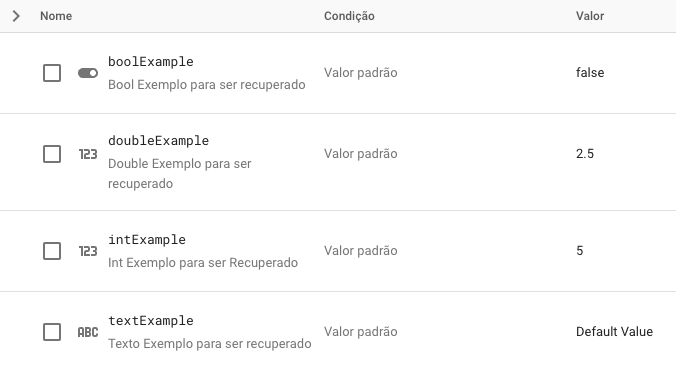

# poc_remote_config

Uma análise das possibilidades do que o Remote Config do Firebse pode acrescentar na sua aplicação.

## Objetivo

Este artigo/projeto tem como objeto apresentar ao leitor funcionalidades do Remote Config que possam ser úteis no para a manutenção e evolução de suas aplicações em seu dia-a-dia. Apesar de não ser focado em ensinar como realizar a configuração e a utilização do Remote Config, este projeto pode ser utilizado como consulta teórica e prática, uma vez que os exemplos que serão citados são originados de uma configuração criada especialmente para este artigo.

## O que é o Remote Config?

O Remote Config é uma ferramenta disponibilizada pelo Firebase que possibilita ao o usuário definir e alterar em tempo real parâmetros que personalizam a sua aplicação. Isso significa que o desenvolvedor ou os responsáveis pela aplicação conseguem alterar layout, funcionalidades e diversas outras configurações de suas aplicações sem a necessidade de um novo deploy!

## Parâmetros

Conforme representado na imagem abaixo, os parâmetros são como  as configurações são armazenadas no firebase. Estes parâmetros possuem tipos diversos, podendo armazenar Strings, números, booleanos e até Json.

O nome do parâmetro (ou chave) é o valor que deve ser informado na aplicação para que a configuração desejada seja recuperada do Firebase.
A descrição é um campo opicional que pode conter uma informação que ajudará ao usuário do firebase a identificar sobre qual configuração este parâmetro está referenciando.

O valor default é o valor que a configuração vai assumir caso não se encaixe em nenhuma condição adicionada pelo usuário ou até mesmo caso não haja nenhuma condição.

## Exemplos

Nesta seção iremos exemplificar o que pode ser feito com o Remote Config, afim de apresentar para o usuário um catalogo do que pode ser alcançado com essas soluções.

Caso deseje ver uma aplicação consumindo dados do firebase em tempo real, você pode acessar o executável deste projeto clicando [aqui](https://remoteconfigpoc.netlify.app/#/)

- Valores Default

Possivelmente a forma mais utilizada de recuperar informações do Remote Config. Ao adicionarmos um parâmetro no Remote Config, podemos atribuir valores default a estes parâmetros. Uma vez que não adicionemos nenhuma condição o valor sempre será o mesmo para todas as instâncias da aplicação.

Estes valores podem ser recuperados pela aplicação e interagir com as regras tanto de layout como até mesmo com as regras de negócio.

- Valores Condicionais

Quando é necessário configurações diferentes para os usuários é possível utilizar as condições de parâmetros. Com essas condições é possível definir grupos de usuários de forma aleatória ou não configurações específicas para usuários específicos baseado em uma regra de negócio previamente planejada.

Essas regras podem ser as mais diversas, como apresentar um desconto para um grupo de usuários que tem menor probabilidade de realizar compras na aplicação ou mostrar uma mensagem personalizada numa data específica em um país específico para comemorar um feriado nacional.

1. Valores para Plataformas Diferentes

2. Valores para Países Diferentes

:warning: Como o Remote Config recupera não recupera as informações do aparelho mas sim do local de acesso, as três execuções mostram que os aparalhos são do Brasil, mesmo que os emuladores estejam configurados com a localização dos Estados Unidos.

>Para mais exemplos, você pode acessar a documentação oficial clicando [aqui](https://firebase.google.com/docs/remote-config/parameters?hl=pt-br)
>Para mais exemplos de cofiguração do Remote Config, indico este [tutorial](https://www.youtube.com/watch?v=YqSS2mCIR8c&t=627s)